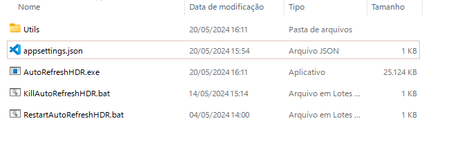

# Auto Refresh HDR

## Presentation
Dynamic Display Manager is a powerful and efficient tool designed for gamers and users who demand the most from their display systems. This C# tool allows automatic customization of display settings, including refresh rate and HDR, based on running specific applications. This is possible because, after informing the tool of the name of the applications and settings you want to use for them, it will "listen" to your processes, changing the settings every time the informed application is detected. When the application or game is closed, the tool will naturally restore the monitor settings to what they were before.

## How did the idea come about?
The idea of ​​building this utility arose due to the need to automate monitor settings, depending on the application or game to be used, as not all applications and games have settings that automatically
change the HDR and refresh rate of the monitor. Furthermore, graphics card utilities, such as Nvidia, do not provide this feature.

## Prerequisites
To use this tool, some prerequisites need to be met. Are they:

* .Net Core 8.0 installed on your machine. Available [HERE](https://dotnet.microsoft.com/download/dotnet/8.0).
* Windows 10 or higher (x64).

## How to use the tool?

After meeting the prerequisites, you can now use the tool. Using it is an extremely easy task.

First of all, extract the tool to any folder on your computer. When extracting the tool, you will have a folder with the following structure.



A crucial and important file, which makes the magic happen, is ```appsettings.json```. In it, you will tell the tool the screen refresh rate setting you want to use and, also, whether you want to activate the screen's HDR for the desired game or application. You can open this file with Windows Notepad or, if you prefer, with a code editor. When you open the file, you will see the following code.

```jsonc
{
  // Fill in the ProgramDisplayConfigs property with the settings for your programs, as shown in the examples
  // To apply the changes, run the RestartAutoRefreshHDR.bat file.
  "ProgramDisplayConfigs": [
    {
      "ProgramName": "executable_exemple1.exe",
      "RefreshRate": 144,
      "Hdr": true
    },
    {
      "ProgramName": "executable_exemple2.exe",
      "RefreshRate": 144,
      "Hdr": false
    },
    {
      "ProgramName": "executable_exemple3.exe",
      "RefreshRate": 144,
      "Hdr": false
    }
  ]
}

```

Make the necessary modifications and then save this file. Once that's done, now just run the ```AutoRefreshHDR.exe``` file and it will take care of the rest.

### I made a modification to the ```appsettings.json``` file. How to make the tool see the new changes?

It's quite simple. To do this, simply run the ```RestartAutoRefreshHDR.bat``` script which will reinitialize the tool and, therefore, apply the new changes.

#### I no longer want the tool to change my monitor settings, according to the applications configured in ```appsettings.json```. How do I do?

There are two ways to do this:

1. Remove unwanted applications from ```appsettings.json``` and restart the tool.

2. Run ```KillAutoRefreshHDR.bat```. Unlike ```RestartAutoRefreshHDR.bat```, this script terminates the process and does not start it again. If you want to run the tool again, just start it again using the file ```AutoRefreshHDR.exe```.

### Usability tip

You can, if you prefer, configure the tool to start alongside Windows, eliminating the need to run it before running your configured games or applications. To do this, simply create a shortcut and paste it in the ```%ProgramData%\Microsoft\Windows\Start Menu\Programs\StartUp``` directory, if you want the tool to start for all users, or in the ```% directory AppData%\Microsoft\Windows\Start Menu\Programs\Startup```, if you want the tool to start only for the logged in user in question.

## Important information about using this tool.

* The tool will not overclock the monitor. Any and all settings defined in the ```appsettings.json``` file will only be applied if your monitor and/or video card supports it.
* If any setting, be it refresh rate or HDR, is not supported by your system, a warning message will be displayed as soon as the application configured with the incompatible attributes is run.

## Final considerations

I believe that the tool is very necessary for the community, especially the gaming community who, like me, occasionally come across situations that prevent them from taking full advantage of their system. Therefore, I was motivated to build it, as a way to help myself and help the community as well.

## Additional information and credits

This tool works in conjunction with two other tools, **hdr_switch_tray**, which aims to change the system's HDR, and **QRes.exe**, which allows you to change the monitor's refresh rate. I am grateful to the developers and I will leave links to the source code of the projects below, giving them due credit.

- **QRes:** https://sourceforge.net/projects/qres/
- **hdr_switch_tray**: https://github.com/bradgearon/hdr-switch


